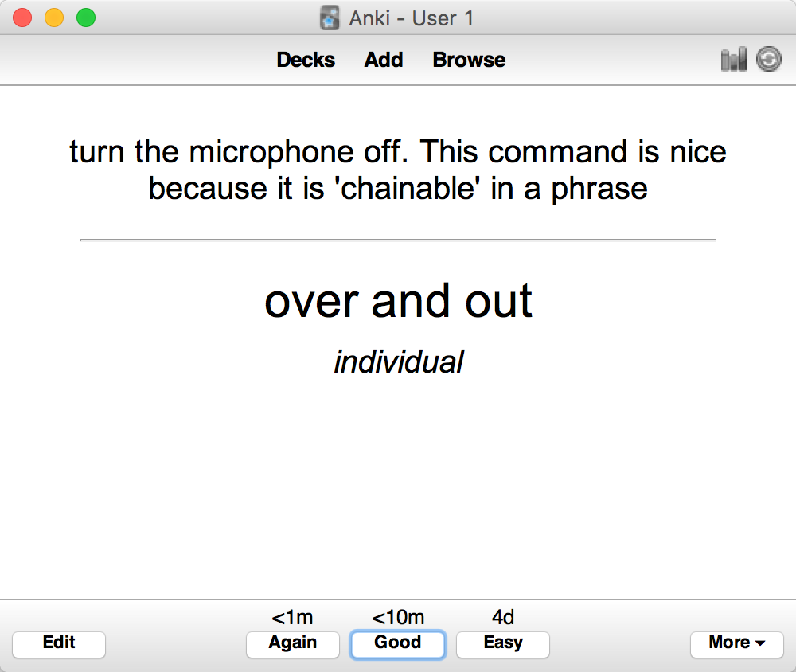
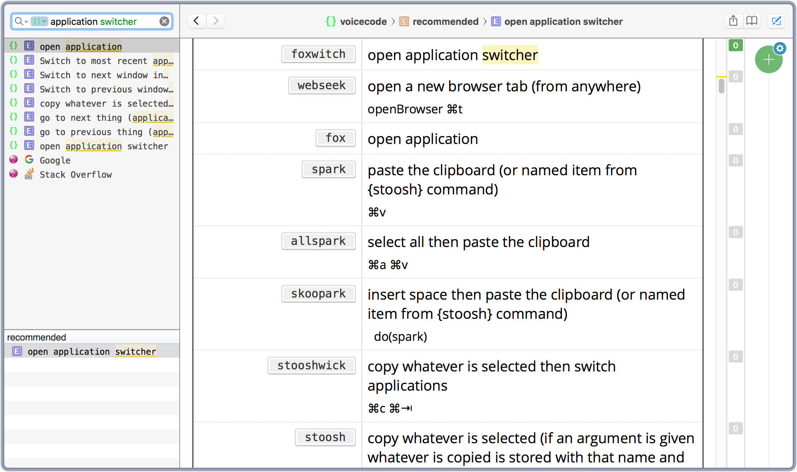

# VoiceCode Tools

> A few tools to make your voicecoding life easier.


**Get VoiceCode at http://voiceode.io**

## Tool 1: Command Parser

Parse your VoiceCode commands into different formats

Currently supported formats: `dash cheatset`, `tab separated file`

```
$ cd commands-export
$ pip3 install selenium
$ ./export-commands.py --help
usage: VoiceCode Command Parser [-h] (--anki | --cheatset)
                                [--url URL | --csv CSV]
                                [tags [tags ...]]

positional arguments:
  tags        zero or more tags to export, if none are provided, all commands
              will be exported

optional arguments:
  -h, --help  show this help message and exit
  --anki      anki output: produce a csv file suitable for importing into anki
  --cheatset  cheatsheet output: produce ruby output suitable for creating a
              Dash docset from (via cheatset)
  --url URL   URL to the VoiceCode commands page (must be accessible, default:
              http://commando:5000/commands)
  --csv CSV   Instead of scraping the commands page, use a provided csv file
```

### Example: Export Anki Deck Of `recommended` commands



```
$ ./export-commands.py --anki recommended > recommended.tsv
# then import recommended.tsv with anki
```

### Example: Export a dash docset of `application`  and 'cursor' commands

```
$ ./export-commands.py --cheatset application cursor > ../dash-docset-cheatsheet/voicecode.rb
# then see Tool 2
```

## Tool 2: Create a cheatsheet for [Dash](https://kapeli.com/dash)


```
 # use export tool to create voicecode.rb
 $ cd ./dash-docset-cheatsheet
 $ make
  Generating voicecode.docset
  Done. Import voicecode-tools/dash-docset-cheatsheet/voicecode.docset into dash
```
